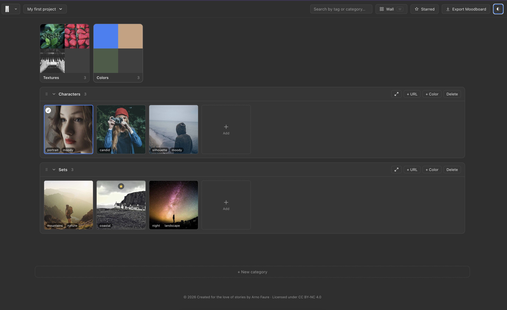

# Moodboard

A 100% free, single-file moodboard web app — created for the love of stories by [Arno Faure](https://arnofaure.com).

🔗 **[moodboard.arnofaure.com](https://moodboard.arnofaure.com)** · 📝 [Changelog](CHANGELOG.md)

## Features

- Drag & drop images to build your moodboard, organized into categories (Characters, Sets, Textures, Colors — or your own)
- Add images by dropping files, pasting a copied image or an image URL, or the `+` tile in any category
- Collapse categories into small thumbnail cards, reorder them by dragging the ⠿ handle, or expand any one full-page
- **Wall view** (`W`) shows every image at its real aspect ratio instead of a cropped square — mixed across all categories, or focused on just one
- Tag and search images by tag or category
- Star favorites (`S`) and filter to starred-only
- Notes per image
- Extract a 5-color palette from any local image, attached directly to it and shown as a strip on its thumbnail
- Add a color swatch by hand with a hex or RGB value — gets a meaningful name automatically (nearest CSS named color)
- Multi-select (shift/cmd-click or the corner checkbox) with bulk move / tag / delete
- Multiple projects, each with its own thumbnail preview in the project switcher
- Save/open projects as JSON (`Cmd/Ctrl+S`)
- Export the whole moodboard as a PNG image
- Multiple background themes (dark, white, grey, dark grey)
- Runs entirely in your browser — no account, no upload, no tracking

## Usage

Just open `index.html` in a browser, or visit [moodboard.arnofaure.com](https://moodboard.arnofaure.com).

## How to use it

1. **Everything stays on your device.** Moodboard runs entirely in your browser — your images and projects are never uploaded, no account needed.
2. **Add images** by dragging files in, pasting (`Cmd/Ctrl+V`) a copied image or an image URL, or the `+` tile in any category.
3. **Organize with categories.** Collapse one into a small card, drag the ⠿ handle to reorder, or expand any one full-page with the ⤢ icon.
4. **Tag, star, search.** Add tags and notes from the image view, star favorites (`S`), and filter by tag, category, or starred only.
5. **Colors.** Extract a palette from any local image, or add one by hand with a hex/RGB value — both get a meaningful name automatically.
6. **Wall view** (`W`) shows every image at its real aspect ratio, mixed across categories or focused on just one.
7. **Nothing is saved to a file automatically.** Use **Save** (`Cmd/Ctrl+S`, in the menu) to download a project file (`.json`), and **Open** to restore it later.

The same info is available anytime in the app via **Menu → Help**.

## Contact

Bug, idea, or feature request? — [info@arnofaure.com](mailto:info@arnofaure.com)

## License

Code is open source. Content/branding is licensed under [CC BY-NC 4.0](https://creativecommons.org/licenses/by-nc/4.0/).
